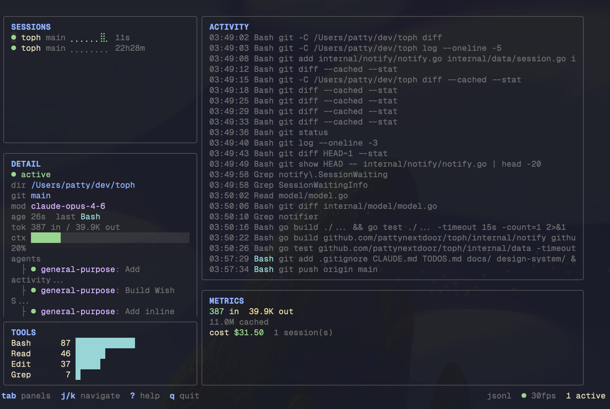

# toph

**btop for AI agents.** A beautiful terminal dashboard that monitors AI coding agent activity in real-time.

Your AI agents are working. Are you watching? See every tool call, token burn, and context fill across all your sessions -- one terminal, zero config, real-time.

> [!NOTE]
> toph currently supports [Claude Code](https://claude.ai/code). Support for other agents (Aider, Codex, Cursor) is planned.



## Features

- **Zero-config** -- Just run `toph`. It discovers Claude Code sessions from `~/.claude/projects/` automatically.
- **Real-time** -- 30fps dashboard powered by fsnotify file watching. No polling, no lag.
- **Session monitoring** -- See active, waiting, idle, and errored sessions with color-coded status indicators. Permission-waiting sessions pulse amber.
- **Activity feed** -- Live stream of tool calls, file writes, and errors across all sessions. Color-coded, scrollable, with a 1,000-event ring buffer.
- **Token metrics** -- Input/output tokens, cache hits, and estimated cost per session and per day. Model-aware pricing for Opus, Sonnet, and Haiku.
- **Context meter** -- Visual progress bar showing context window usage with spring-eased animations on value change.
- **Subagent tree** -- See spawned subagents and their status in the session detail panel.
- **Tool frequency chart** -- Horizontal bar chart of which tools (Bash, Edit, Read, etc.) are called most across all sessions.
- **Filter** -- Press `/` to filter sessions and events by project, tool, or text.
- **Hooks integration** -- Optional HTTP hooks on `localhost:7891` for richer real-time data. Run `toph setup` to configure.
- **Read-only** -- toph observes. It never creates, kills, or modifies sessions.

## Install

### Go

```sh
go install github.com/pattynextdoor/toph/cmd/toph@latest
```

### Homebrew (macOS)

```sh
brew install pattynextdoor/tap/toph
```

### From source

```sh
git clone https://github.com/pattynextdoor/toph.git
cd toph
go build -o toph ./cmd/toph
```

## Usage

```sh
# Just run it -- zero config needed
toph

# Enable debug logging
toph --debug

# Configure Claude Code hooks for richer data (optional)
toph setup

# Remove hook configuration
toph setup --remove
```

## Keybindings

| Key | Action |
|-----|--------|
| `Tab` / `Shift+Tab` | Cycle panel focus |
| `j` / `k` / `Up` / `Down` | Navigate within panel |
| `Enter` | Select session |
| `/` | Filter |
| `Esc` | Clear filter |
| `r` | Force refresh |
| `1`-`5` | Jump to panel |
| `G` / `g` | Activity feed bottom / top |
| `Ctrl+L` | Clear activity feed |
| `?` | Help overlay |
| `q` / `Ctrl+C` | Quit |

## Layout

toph renders five panels arranged in a responsive grid:

| Panel | Position | Description |
|-------|----------|-------------|
| **Sessions** | Top-left | Auto-detected session list with status icons and sort-by-actionability |
| **Detail** | Bottom-left | Selected session info: status, subagent tree, context fill, working directory |
| **Activity** | Top-right | Scrollable real-time event stream across all sessions |
| **Metrics** | Bottom-right | Token counts, cost tracking, burn rate, context fill meter |
| **Tools** | Bottom-left | Horizontal bar chart of tool call frequency |
| **Status Bar** | Bottom | Keybinding hints, data source indicator, connection status |

Recommended terminal size: **80x30 minimum**, 120x40 ideal.

## How It Works

1. **File watching** -- toph uses fsnotify to watch `~/.claude/projects/` for JSONL log files that Claude Code writes during sessions. On startup, it backfills the last ~200 lines from each active session for instant context.
2. **Event parsing** -- JSONL records are parsed into normalized events: assistant messages (with token usage), tool calls, progress updates, and system events.
3. **Event bus** -- Events flow through Go channels into the Bubble Tea model, which batches updates at 30fps to avoid flicker during bursts.
4. **Rendering** -- Lip Gloss styles the panels with rounded borders, color-coded status indicators, and gradient progress bars. Harmonica provides spring-based easing for animated elements.

toph implements a `Source` interface, making it straightforward to add new data sources beyond Claude Code in the future.

## Configuration

### Hooks (optional)

Running `toph setup` configures Claude Code hooks in `~/.claude/settings.json` to POST events to a local HTTP server on `127.0.0.1:7891`. This provides richer real-time data including permission requests, CWD changes, and session lifecycle events.

```sh
# Preview what will change (dry run)
toph setup

# Remove hook configuration
toph setup --remove
```

The hooks server binds to localhost only and never accepts remote connections.

### Debug logging

```sh
toph --debug
```

Writes structured logs via `slog` to a file for troubleshooting.

## License

[MIT](LICENSE)
